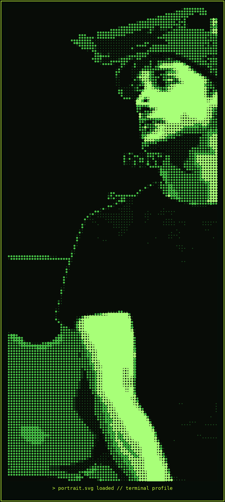

<div align="center">



<br/><br/>


&nbsp;

&nbsp;


<br/><br/>

<a href="https://www.linkedin.com/in/nilesh-singh-b9b6932bb"></a>
&nbsp;&nbsp;
<a href="mailto:kumarnilash509@gmail.com"></a>
&nbsp;&nbsp;
<a href="https://github.com/Nilesh-builds"></a>
&nbsp;&nbsp;
<a href="https://nilesh-builds.github.io/"></a>

<br/><br/>


&nbsp;

&nbsp;


</div>

---

## `> whoami`

BCA student specializing in **Data Science** at Sri Balaji University, Pune, building toward a career in **Data Analytics and AI Evaluation**. I turn messy datasets into tested pipelines, interpretable models, and dashboards — then explain what the evidence can and cannot prove.

Alongside my coursework, I've worked as a **Cloud Application Developer intern** at Codefirst Technology. My portfolio focuses on the work after the model: data quality, evaluation, business trade-offs, and human review.

```bash
$ cat .profile

ROLE        =  Data Analyst  |  AI Evaluation
STATUS      =  BCA (Data Science) Student — Sri Balaji University
DOMAIN      =  Analytics  |  Data Quality  |  AI Evaluation
TOOLS       =  Python  |  SQL  |  Power BI  |  Excel  |  R
INTERNSHIP  =  Cloud Application Developer — Codefirst Technology
PORTFOLIO   =  Customer Churn Analysis  |  Restaurant Demand Forecasting  |  LLM Safety Eval Benchmark  |  LinguaQ
LOCATION    =  Pune, India
OPEN_TO     =  Data Analyst  |  AI Trainer  |  AI Evaluation Roles
```

---

## `> ls /tech-stack`

<div align="center">

**[ Languages ]**


**[ Data &amp; Analytics ]**


**[ Cloud &amp; Tools ]**


</div>

<br/>

<div align="center">

**[ Analytics &amp; ML ]**


</div>

---

## `> cat analytics-expertise.json`

| Domain | Proficiency | Details |
| :-- | :-- | :-- |
| **Data Cleaning &amp; EDA** | `█████ Advanced` | Pandas, missing-value handling, outlier detection, feature engineering |
| **Machine Learning** | `████░ Intermediate` | Logistic Regression, Random Forest, Decision Trees, model selection on business criteria |
| **Data Visualization** | `████░ Intermediate` | Power BI dashboards, Excel reporting, matplotlib/seaborn charting |
| **SQL &amp; Databases** | `████░ Intermediate` | Querying, joins, aggregation for analysis-ready datasets |
| **Statistical Analysis** | `████░ Intermediate` | Hypothesis-driven EDA, risk scoring, business recommendation write-ups |
| **Cloud (AWS)** | `███░░ Working Knowledge` | Cloud-native architecture from Codefirst Technology internship |

---

## `> ls /projects --sort=impact`

<details open>
<summary><b>&#9654; Customer Churn Analysis &mdash; Telco Dataset</b></summary>

<br/>

Production-style churn analysis: data-quality checks, SQL views, leakage-safe modeling, cross-validation, calibration, cost-sensitive thresholds, and a live human-review dashboard.

| Aspect | Detail |
| :-- | :-- |
| **Stack** | Python &middot; SQL &middot; Pandas &middot; scikit-learn &middot; Streamlit |
| **Data Prep** | Numeric coercion of `TotalCharges`, missing-value handling, duplicate investigation |
| **Modeling** | Logistic Regression &middot; Random Forest (default) &middot; Random Forest (class-weighted) |
| **Selection** | Balanced Random Forest chosen on business reasoning, not just accuracy |
| **Deliverables** | Tested pipeline, SQLite views, model card, threshold scenarios, live dashboard |
| **Live demo** | [Customer Churn Decision Support](https://nilesh-customer-churn.streamlit.app/) |
| **Repo** | [`github.com/Nilesh-builds/customer-churn-analysis`](https://github.com/Nilesh-builds/customer-churn-analysis) |

</details>

<details open>
<summary><b>&#9654; LLM Safety &amp; Response Evaluation Benchmark</b></summary>

<br/>

A controlled benchmark evaluating AI model responses across 9 dimensions — instruction following, factuality, relevance, bias, toxicity, refusal quality, prompt injection resistance, hallucination, and consistency — built entirely on free-tier APIs.

| Aspect | Detail |
| :-- | :-- |
| **Stack** | Python &middot; Groq free-tier APIs &middot; pandas &middot; matplotlib &middot; Streamlit &middot; Jupyter |
| **Dataset** | 200 cases spanning all 9 dimensions, 400 evaluated model responses |
| **Scoring** | Rule-based checks + a 2-model LLM-judge ensemble, with 95% bootstrap intervals |
| **Judge validation** | Calibration against known-good/bad reference responses (11/11 exact match) + blind human review by 2 independent reviewers (60 samples, human-vs-human quadratic weighted kappa=0.902; judge-vs-human kappa≈0.62) |
| **Finding** | GPT-OSS-120B composite 4.33 vs GPT-OSS-20B 4.18 — both strongest on toxicity/relevance, weakest on hallucination (~3.0) and refusal quality (~3.5) |
| **Live demo** | [LLM Evaluation Evidence Dashboard](https://llm-safety-eval-benchmark-vrjugdrizxtaqt38s6mgep.streamlit.app/) |
| **Repo** | [`github.com/Nilesh-builds/llm-safety-eval-benchmark`](https://github.com/Nilesh-builds/llm-safety-eval-benchmark) |

</details>

<details>
<summary><b>&#9654; LinguaQ &mdash; Language Detection App</b></summary>

<br/>

A Streamlit web app that detects the language of any input text in real time.

| Aspect | Detail |
| :-- | :-- |
| **Stack** | Python &middot; Pandas &middot; Streamlit &middot; langdetect |
| **Function** | Takes text input, returns the detected language |
| **Interface** | Interactive Streamlit web app |
| **Status** | Finished and working |
| **Repo** | [`github.com/Nilesh-builds/linguaq`](https://github.com/Nilesh-builds/linguaq) |

</details>

<details>
<summary><b>&#9654; Restaurant Demand Forecasting &mdash; Reducing Food Waste</b></summary>

<br/>

Demand and prep forecasting model built on public restaurant sales data, framed around helping restaurants cut food waste through better prep planning.

| Aspect | Detail |
| :-- | :-- |
| **Stack** | Python &middot; Pandas &middot; Power BI |
| **Goal** | Forecast demand to right-size prep and reduce waste |
| **Deliverable** | Power BI dashboard summarizing forecast vs. actual demand |
| **Status** | In progress — part of an active portfolio build |
| **Repo** | `coming soon` |

</details>

<details>
<summary><b>&#9654; AI HR Automation Suite &mdash; 6 n8n Workflows</b></summary>

<br/>

A suite of six automation workflows built in n8n to streamline common HR processes end-to-end — from onboarding through candidate screening.

| Aspect | Detail |
| :-- | :-- |
| **Stack** | n8n &middot; Google Sheets &middot; OpenAI GPT-4 &middot; Gmail/Slack/WhatsApp integrations |
| **Workflows** | Employee Onboarding Automation &middot; Leave Management System &middot; Employee Sentiment & Feedback Analyzer &middot; AI-Powered Policy Q&A Bot &middot; AI Resume Screener & Candidate Ranker &middot; WhatsApp HR Chatbot |
| **Data Layer** | Google Sheets as the shared data store across workflows |
| **AI Layer** | GPT-4 used for sentiment analysis, Q&A responses, and resume ranking |
| **Notifications** | Gmail, Slack, and WhatsApp integrations for HR-facing alerts |
| **Repo** | https://github.com/Nilesh-builds/ai-hr-automation-suite |

</details>

---

## `> cat experience.log`

**Cloud Application Developer (Intern)** &mdash; **Codefirst Technology**

Hands-on experience building cloud-native applications, applying AWS fundamentals alongside coursework in data science.

`AWS` `Cloud-Native Architecture` `Application Development`

---

## `> git log --oneline /education`

<div align="center">


</div>

---

## `> cat certifications.sh`

<div align="center">


</div>

---

## `> git stats --global`

<div align="center">


<br/>


</div>

---

## `> trophy-case --display`

<div align="center">


</div>

---

## `> activity-graph --timeline`

<div align="center">


</div>

---

## `> cat current-focus.yaml`

```yaml
learning:
  - Advanced machine learning & model evaluation
  - Power BI dashboard design for business storytelling

building:
  - llm-safety-eval-benchmark  # 9-dimension LLM safety benchmark, free-tier APIs, judge validation
  - customer-churn-analysis   # Telco churn EDA + ML + Power BI
  - restaurant-demand-forecasting  # Demand forecasting to reduce food waste
  - ai-hr-automation-suite    # 6 n8n workflows automating HR processes
  - linguaq                   # Streamlit language detection app

studying:
  - BCA, Data Science — Sri Balaji University, Pune

open_to:
  - Data Analyst roles
  - Business Analyst roles
  - AI Trainer roles
```

---

## `> ping me`

<div align="center">

<a href="mailto:kumarnilash509@gmail.com"></a>
<a href="https://www.linkedin.com/in/nilesh-singh-b9b6932bb"></a>
<a href="https://github.com/Nilesh-builds"></a>
<a href="https://nilesh-builds.github.io/"></a>

</div>

---

<div align="center">

<sub><i>// student by day &nbsp;|&nbsp; building an analytics portfolio, one dataset at a time</i></sub>

<br/><br/>


</div>
