<div align="center">


<br/>


&nbsp;

&nbsp;


<br/><br/>

<a href="https://readme-typing-svg.demolab.com?font=Fira+Code&pause=1200&color=CAFF3C&background=060D0800&center=true&vCenter=true&width=620&lines=Data+Quality+%7C+LLM+Evaluation+%7C+Dashboards;Tested+pipelines%2C+not+notebook+demos;Evidence+first%2C+hype+never"></a>

<br/>

<a href="https://www.linkedin.com/in/nilesh-singh-b9b6932bb"></a>
&nbsp;&nbsp;
<a href="mailto:kumarnilash509@gmail.com"></a>
&nbsp;&nbsp;
<a href="https://github.com/Nilesh-builds"></a>
&nbsp;&nbsp;
<a href="https://nilesh-builds.github.io/"></a>
&nbsp;&nbsp;
<a href="https://github.com/Nilesh-builds?tab=stars"></a>

</div>

```bash
$ whoami

BCA student specializing in Data Science at Sri Balaji University, Pune,
building toward Data Analytics and AI Evaluation. I turn messy datasets
into tested pipelines, interpretable models, and dashboards — then explain
what the evidence can and cannot prove.

Alongside coursework, I interned as a Cloud Application Developer at
Codefirst Technology. My work lives after the model: data quality,
evaluation, business trade-offs, and human review.

$ cat .profile

ROLE        =  Data Analyst  |  AI Evaluation
STATUS      =  BCA (Data Science) Student — Sri Balaji University
DOMAIN      =  Analytics  |  Data Quality  |  AI Evaluation
TOOLS       =  Python  |  SQL  |  Power BI  |  Excel  |  R
INTERNSHIP  =  Cloud Application Developer — Codefirst Technology
PORTFOLIO   =  TrainLens  |  Customer Churn Analysis  |  LLM Safety Eval Benchmark
LOCATION    =  Pune, India
OPEN_TO     =  Data Analyst  |  AI Trainer  |  AI Evaluation Roles
```


## `> ls /projects --sort=impact`

### &#9654; TrainLens — AI Training Data Quality Platform


Customer-support data quality and evaluation platform: five quality dimensions, eleven checks, Groq batch labeling with rule-based fallback, confidence-based human review queue, and accuracy / F1 / calibration reporting. Benchmarked on 852 synthetic conversations at a 98.85% quality score.

**Stack:** Python · pandas · DuckDB · Streamlit · Plotly · scikit-learn
**Live demo:** [TrainLens Dashboard](https://trainlens-gv48ihtbq6nbapgfrlworc.streamlit.app/) · **Repo:** [`Nilesh-builds/trainlens`](https://github.com/Nilesh-builds/trainlens)

### &#9654; LLM Safety & Response Evaluation Benchmark


A controlled benchmark scoring AI responses across 9 dimensions — instruction following, factuality, relevance, bias, toxicity, refusal quality, prompt injection resistance, hallucination, consistency — entirely on free-tier APIs. Rule-based checks plus a 2-model LLM-judge ensemble with 95% bootstrap intervals. Judges validated against references (11/11) and blind human review (human-vs-human κ=0.902). GPT-OSS-120B composite 4.28 vs GPT-OSS-20B 4.18.

**Stack:** Python · Groq free-tier APIs · pandas · matplotlib · Streamlit · Jupyter
**Live demo:** [LLM Evaluation Evidence Dashboard](https://llm-safety-eval-benchmark-vrjugdrizxtaqt38s6mgep.streamlit.app/) · **Repo:** [`Nilesh-builds/llm-safety-eval-benchmark`](https://github.com/Nilesh-builds/llm-safety-eval-benchmark)

### &#9654; Customer Churn Analysis — Telco Dataset


Production-style churn analysis: data-quality checks, SQL views, leakage-safe modeling with cross-validation and calibration, cost-sensitive thresholds, and a live human-review dashboard. Balanced Random Forest chosen on business reasoning, not accuracy alone.

**Stack:** Python · SQL · Pandas · scikit-learn · Streamlit
**Live demo:** [Customer Churn Decision Support](https://nilesh-customer-churn.streamlit.app/) · **Repo:** [`Nilesh-builds/customer-churn-analysis`](https://github.com/Nilesh-builds/customer-churn-analysis)

### &#9654; AI HR Automation Suite — 6 n8n Workflows

Six automation workflows streamlining HR end-to-end: employee onboarding, leave management, sentiment & feedback analysis, policy Q&A bot, AI resume screener & ranker, and a WhatsApp HR chatbot — Google Sheets as the shared data store, GPT-4 as the AI layer, Gmail/Slack/WhatsApp for alerts.

**Stack:** n8n · Google Sheets · OpenAI GPT-4 · Gmail/Slack/WhatsApp
**Repo:** [`Nilesh-builds/ai-hr-automation-suite`](https://github.com/Nilesh-builds/ai-hr-automation-suite)


```bash
$ ls /tech-stack --grouped

languages/   python  r  html  css  bash
data/        postgres  mysql
cloud/       aws  git  github  vscode
```

<div align="center">


<br/>


</div>

## `> cat analytics-expertise.json`

| Domain | Proficiency | Details |
| :-- | :-- | :-- |
| **Data Cleaning & EDA** | `█████ Advanced` | Pandas, missing-value handling, outlier detection, feature engineering |
| **Machine Learning** | `████░ Intermediate` | Logistic Regression, Random Forest, Decision Trees, model selection on business criteria |
| **Data Visualization** | `████░ Intermediate` | Power BI dashboards, Excel reporting, matplotlib/seaborn charting |
| **SQL & Databases** | `████░ Intermediate` | Querying, joins, aggregation for analysis-ready datasets |
| **Statistical Analysis** | `████░ Intermediate` | Hypothesis-driven EDA, risk scoring, business recommendation write-ups |
| **Cloud (AWS)** | `███░░ Working Knowledge` | Cloud-native architecture from Codefirst Technology internship |


## `> cat experience.log`

**Cloud Application Developer (Intern)** — **Codefirst Technology**

Hands-on experience building cloud-native applications, applying AWS fundamentals alongside coursework in data science.

`AWS` `Cloud-Native Architecture` `Application Development`

## `> git log --oneline /education`

<div align="center">


</div>

## `> cat certifications.sh`

<div align="center">


</div>


## `> git stats --global`

<div align="center">


<br/>

<picture>
  <source media="(prefers-color-scheme: dark)" srcset="assets/github-snake-dark.svg" />
  <source media="(prefers-color-scheme: light)" srcset="assets/github-snake.svg" />
  
</picture>

</div>

## `> cat current-focus.yaml`

```yaml
learning:
  - Advanced machine learning & model evaluation
  - Power BI dashboard design for business storytelling

building:
  - trainlens                   # Customer-support data quality, AI labeling, and evaluation dashboard
  - llm-safety-eval-benchmark  # 9-dimension LLM safety benchmark, free-tier APIs, judge validation
  - customer-churn-analysis   # Telco churn EDA + ML + Power BI
  - ai-hr-automation-suite    # 6 n8n workflows automating HR processes

studying:
  - BCA, Data Science — Sri Balaji University, Pune

open_to:
  - Data Analyst roles
  - Business Analyst roles
  - AI Trainer roles
```

## `> ping me`

<div align="center">

<a href="mailto:kumarnilash509@gmail.com"></a>
<a href="https://www.linkedin.com/in/nilesh-singh-b9b6932bb"></a>
<a href="https://github.com/Nilesh-builds"></a>
<a href="https://nilesh-builds.github.io/"></a>

</div>

---

<div align="center">

<sub><i>// student by day &nbsp;|&nbsp; building an analytics portfolio, one dataset at a time</i></sub>

<br/><br/>


</div>
