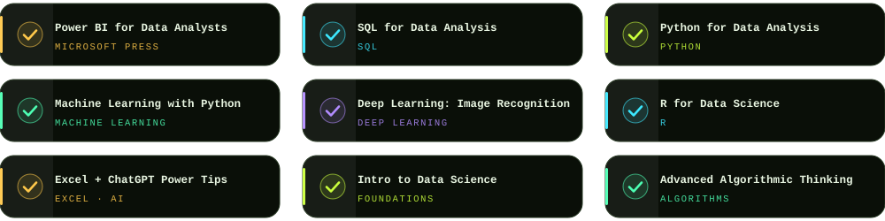

<div align="center">



<br/>

<a href="https://www.linkedin.com/in/nilesh-singh-b9b6932bb"></a>
<a href="mailto:kumarnilash509@gmail.com"></a>
<a href="https://github.com/Nilesh-builds"></a>
<a href="https://nilesh-builds.github.io/"></a>

<br/><br/>



</div>

```bash
$ whoami

BCA student specializing in Data Science at Sri Balaji University, Pune,
building toward Data Analytics and AI Evaluation. I turn messy datasets
into tested pipelines, interpretable models, and dashboards — then explain
what the evidence can and cannot prove.

Alongside coursework, I interned as a Cloud Application Developer at
Codefirst Technology. My work lives after the model: data quality,
evaluation, business trade-offs, and human review.
```




<br/>



<p align="center">
<a href="https://trainlens-gv48ihtbq6nbapgfrlworc.streamlit.app/"></a>
<a href="https://llm-safety-eval-benchmark-vrjugdrizxtaqt38s6mgep.streamlit.app/"></a>
<br/>
<a href="https://nilesh-customer-churn.streamlit.app/"></a>
<a href="https://github.com/Nilesh-builds/ai-hr-automation-suite"></a>
</p>

<details>
<summary><b>TrainLens</b> — dashboard preview, write-up, links</summary>

<br/>


Customer-support data quality and evaluation platform: five quality dimensions, eleven checks, Groq batch labeling with rule-based fallback, confidence-based human review queue, and accuracy / F1 / calibration reporting. Benchmarked on 852 synthetic conversations at a 98.85% quality score.

**Stack:** Python · pandas · DuckDB · Streamlit · Plotly · scikit-learn
**Live demo:** [TrainLens Dashboard](https://trainlens-gv48ihtbq6nbapgfrlworc.streamlit.app/) · **Repo:** [`Nilesh-builds/trainlens`](https://github.com/Nilesh-builds/trainlens)

</details>

<details>
<summary><b>LLM Safety & Response Evaluation Benchmark</b> — dashboard preview, write-up, links</summary>

<br/>


A controlled benchmark scoring AI responses across 9 dimensions — instruction following, factuality, relevance, bias, toxicity, refusal quality, prompt injection resistance, hallucination, consistency — entirely on free-tier APIs. Rule-based checks plus a 2-model LLM-judge ensemble with 95% bootstrap intervals. Judges validated against references (11/11) and blind human review (human-vs-human κ=0.902). GPT-OSS-120B composite 4.28 vs GPT-OSS-20B 4.18.

**Stack:** Python · Groq free-tier APIs · pandas · matplotlib · Streamlit · Jupyter
**Live demo:** [LLM Evaluation Evidence Dashboard](https://llm-safety-eval-benchmark-vrjugdrizxtaqt38s6mgep.streamlit.app/) · **Repo:** [`Nilesh-builds/llm-safety-eval-benchmark`](https://github.com/Nilesh-builds/llm-safety-eval-benchmark)

</details>

<details>
<summary><b>Customer Churn Analysis — Telco Dataset</b> — dashboard preview, write-up, links</summary>

<br/>


Production-style churn analysis: data-quality checks, SQL views, leakage-safe modeling with cross-validation and calibration, cost-sensitive thresholds, and a live human-review dashboard. Balanced Random Forest chosen on business reasoning, not accuracy alone.

**Stack:** Python · SQL · Pandas · scikit-learn · Streamlit
**Live demo:** [Customer Churn Decision Support](https://nilesh-customer-churn.streamlit.app/) · **Repo:** [`Nilesh-builds/customer-churn-analysis`](https://github.com/Nilesh-builds/customer-churn-analysis)

</details>

<details>
<summary><b>AI HR Automation Suite — 6 n8n Workflows</b> — write-up, links</summary>

<br/>

Six automation workflows streamlining HR end-to-end: employee onboarding, leave management, sentiment & feedback analysis, policy Q&A bot, AI resume screener & ranker, and a WhatsApp HR chatbot — Google Sheets as the shared data store, GPT-4 as the AI layer, Gmail/Slack/WhatsApp for alerts.

**Stack:** n8n · Google Sheets · OpenAI GPT-4 · Gmail/Slack/WhatsApp
**Repo:** [`Nilesh-builds/ai-hr-automation-suite`](https://github.com/Nilesh-builds/ai-hr-automation-suite)

</details>






<br/>





<br/>





<br/>








<div align="center">


<br/><br/>

<picture>
  <source media="(prefers-color-scheme: dark)" srcset="assets/github-snake-dark.svg" />
  <source media="(prefers-color-scheme: light)" srcset="assets/github-snake.svg" />
  
</picture>

</div>

<br/>


```yaml
learning:
  - Advanced machine learning & model evaluation
  - Power BI dashboard design for business storytelling

building:
  - trainlens                   # Customer-support data quality, AI labeling, and evaluation dashboard
  - llm-safety-eval-benchmark  # 9-dimension LLM safety benchmark, free-tier APIs, judge validation
  - customer-churn-analysis   # Telco churn EDA + ML + Power BI
  - ai-hr-automation-suite    # 6 n8n workflows automating HR processes

studying:
  - BCA, Data Science — Sri Balaji University, Pune

open_to:
  - Data Analyst roles
  - Business Analyst roles
  - AI Trainer roles
```



<div align="center">



<br/>

<a href="mailto:kumarnilash509@gmail.com"></a>
<a href="https://www.linkedin.com/in/nilesh-singh-b9b6932bb"></a>
<a href="https://github.com/Nilesh-builds"></a>
<a href="https://nilesh-builds.github.io/"></a>

<br/><br/>


</div>
